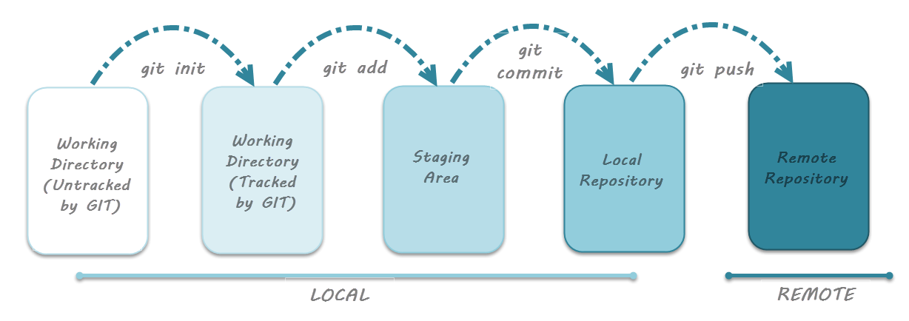

# Git, Github

## İçindekiler

* [1. About Version & Github](#1-about-version--github)
* [2. Getting and Creating Projects](#2-getting-and-creating-projects-proje-oluşturma-ve-projeyi-klonlama)
* [3. Setup & Configuration](#3-setup--configuration-kurulum-ve-yapılandırma)
* [4. Basic Snapshotting](#4-basic-snapshotting-temel-anlık-görüntü)
* [5. Branching and Merging](#5-branching-and-merging-dallanma-ve-birleşme)
* [6. Sharing and Updating](#6-sharing-and-updating-projects-projeleri-paylaşma-ve-güncelleme)
* [7. Faydalı Linkler](#7-faydalı-linkler)

## 1. About Version & Github



---

## 2. Getting and Creating Projects (Proje Oluşturma ve Projeyi Klonlama)

* ### Yerel Depo Oluşturma (git init)

    Mevcut projeniz için git ile versiyon kontrolü yapabilmek için öncelikle yerel bir Git Deposu (Repository) oluşturalım.

    ```Bash

    # Bir .git dizini oluşturun.
    > git init

    ```

* ### Dosyaları Sahneye Alma (git add)

    ```Bash

    # Sözde Kod:

    # Seçilen dosyayı ekler.
    > git add [dosya]

    # Seçilen dizini ekler.
    > git add [dizin]

    # Tüm dizini ekler.
    > git add [.]

    # Örnek:

    # Tüm dosyaları dizine ekleyin.
    > git add .

    ```

* ### Sahnedeki Dosyaları Depoya Ekleme (git commit)

    ```Bash

    # Projenizin güncel halini commit yaparak history'ye kayıt edin.
    > git commit -m "commit mesajınızı buraya yazın."

    # Tebrikler projenizin yeni bir versiyonunu oluşturdunuz.

    ```

## 3. Setup & Configuration (Kurulum Ve Yapılandırma)

Git kullanmaya başlamadan önce terminal üzerinden git loglar vb için kullanıcı adı ve kullanıcı e-posta adresi tanımlamanız gerekmektedir. Bu bilgiler commit ettiğinizde kimin tarafından commit edilmiş bilgisini tutmak için kullanılacaktır. Aynı zamanda local alanınızda çalıştığınız projeyi Github'a yüklediğinizde de burada tanımlanan kullanıcı adı ve kullanıcı e-posta adresi üzerinden yükleme yapacaktır.

* ### Kullanıcı adı

    ```Bash

    # Kullanıcı adını öğrenmek için
    > git config --global user.name

    # Kullanıcı adını değiştirin
    > git config --global user.name "Hakan CERAN"

    ```

* ### Kullanıcı E-Posta

    ```Bash

    # Kullanıcı E-Posta adresini öğrenmek için
    > git config --global user.email

    # Kullanıcı E-Posta adresini değiştirin
    > git config --global user.email "hakanceran64@gmail.com"

    ```

* ### Depoyu Klonlama (git clone)

    Remote repository'yi yerek diskinize indirir.

    ```Bash

    # Sözde Kod:
    > git clone [url]

    # Örnek:
    > git clone https://github.com/hakanceran64/Github.git

    ```

---

## 4. Basic Snapshotting (Temel Anlık Görüntü)

* ### Açıklama Basic Snapshotting

    ```Bash

    # Dosya İçeriğini dizine ekleyin.
    > git add .

    # 
    > git status

    #
    > git diff

    #
    > git commit

    #
    > git notes

    #
    > git restore

    #
    > git reset

    # Depodan Dosya Silme
    > git rm

    #
    > git mv

    ```

---

## 5. Branching and Merging (Dallanma ve Birleşme)

* ### Açıklama Branching and Merging

    ```Bash
        
        > git branch
        > checkout
        > switch
        > merge
        > mergetool
        > log
        > stash
        > tag
        > worktree
    
    ```

---

## 6. Sharing and Updating Projects (Projeleri Paylaşma ve Güncelleme)

Başka bir repodaki güncellemeleri alma ve yerel repoları güncelleme komutları.

* ### git remote

    Güncelleme yapabilmeniz için uzak reponun url'sini tanımlamanız gerekmektedir. (Bu işlem yalnızca bir kereye mahsustur.)

    ```Bash

    # takma ad (alias) kullanarak bir git url'si belirleyin.
    > git remote add [alias] [url]

    # Örnek
    > git remote add origin https://github.com/hakanceran64/Github.git

    ```

* ### git fetch

    Uzak reponuzda takım arkadaşlarınız güncelleme yapmış olsun. Bu güncellemeleri bilgisayarınıza indirip incelemek için git fetch (fetch türkçe anlamı getirmek) komutunu kullanabilirsiniz.

    ```Bash

    # remote'daki reponuzu local'inize indirir.
    > git fetch [alias]

    # Örnek: daha önce origin takma adı ile remote'da bulunan repomuzu local'de incelemek için indirir.
    > git fetch origin

    # Log'ları inceleyin.
    > git log

    # İki repo arasındaki farkları inceleyin
    > git diff

    ```

* ### git pull

    git fetch ile local'inize indirdiğiniz değişikleri merge etmek istiyorsanuz git pull (pull türkçe anlamı çekmek) yapabilirsiniz. *git pull = git fetch + git merge* olarak düşünebilirsiniz. Birçok geliştirici git pull kullanmayı tavsiye etmiyor. Detaylar için *Git: fetch and merge, don't pull* aramasını yapabilirsiniz.

    ```Bash

    #
    > git pull

    ```

* ### git push

    Local değişikliklerinizi online reponuza göndermek için kullanılır. *git push* yapmadığınız sürece bütün değişikler yalnızca sizin bilgisayarınızda saklanır. Ekip arkadaşlarınızın da değişiklikleri görmesini istiyorsanız *git push* yaparak değişiklikleri remote reponuza uygulayabilirsiniz.

#### *git push* komutu iki adet argüman alır

* a remote name: origin
* a branch name: main

    ```Bash

    # Yerel reponuzu uzak repoya transfer eder.
    > git push [alias] [branch_name]

    # Örnek
    > git add .
    > git commit -m "commit description"
    > git push origin main

    ```

* ### git submodule

    ```Bash

    #
    > submodule

    ```

---

## 7. Faydalı Linkler

* [Türkçe Git 101](https://aliozgur.gitbooks.io/git101/content/)

* [Git Life Cycle](https://www.toolsqa.com/git/git-life-cycle/)

---
